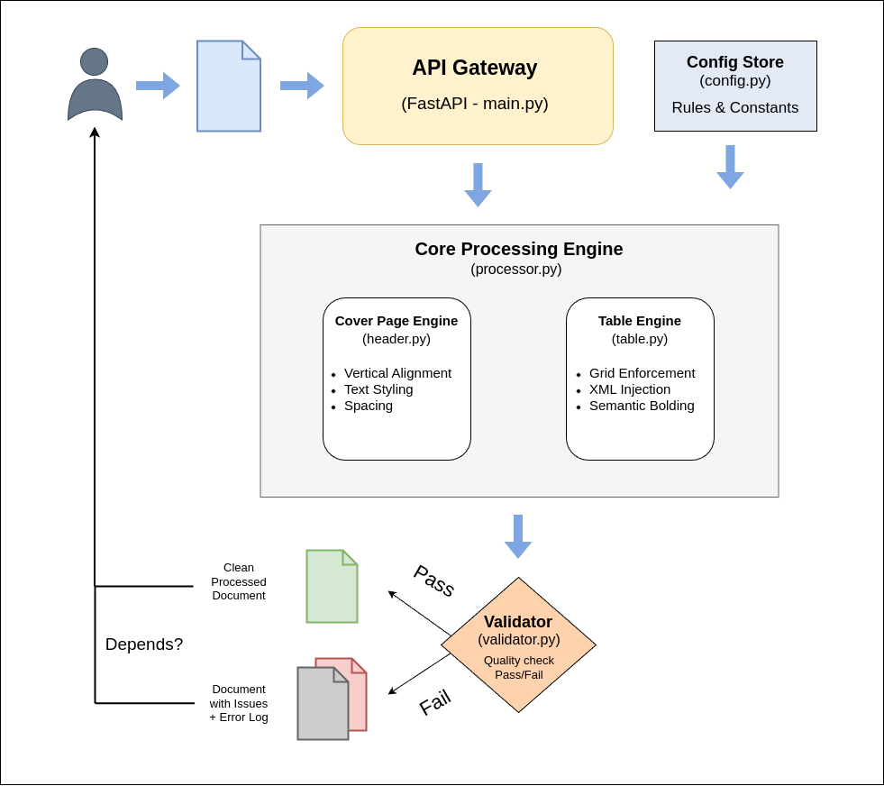

# Assignment 3: Hrayr Muradyan

Automated Financial Document Formatting System

## Summary:

This system automates the formatting of financial documents **(.docx)**. It fixes style inconsistencies in cover pages (titles, dates) and financial tables (borders, bolding, margins). The goal is to replace manual review with a programmatic, rule-based engine that ensures every report matches the "Style Guide."

## High-level Architecture

The code is organized into the following layers:

**Layer 1**: Interface Layer (How users can access it)

- **CLI**: For developers or local batch processing
- **REST API (FastAPI)**: For integrating into web apps or other software

**Layer 2**: Core Processing Layer

- **Orchestrator** (`processor.py`): Manages the processing of the document.
- **Logic Modules** (`header.py`, `table.py`): Apply specific style rules for different components of the document.
- **Validation** (`validator.py`): Checks if the output is correct.

**Layer 3**: Configuration Layer (`config.py`)

- Stores constants like fonts, margins, and spacing in one place.

The diagram below shows the high-level architecture:



## Technology

| Category            | Technology        | Description                                                                 |
|---------------------|-------------------|-----------------------------------------------------------------------------|
| Language            | Python 3.10+      | Chosen for strong text processing capabilities and library ecosystem.       |
| Core Library        | python-docx       | Standard for manipulating MS Word documents programmatically.               |
| XML Manipulation    | lxml              | Used internally by python-docx for advanced formatting not exposed by API.  |
| Testing             | PyTest            | Verify that the system works as expected.                                   |

## Detailed Component Design

### Configuration Module

Instead of hardcoding certain rules, it’s better to keep a style definition. As, the requirements might change through time.

```python
class StyleConfig:
    """Centralized configuration for style rules."""

    FONT_NAME = "Arial"
    FONT_SIZE = Pt(9)
    
    # Cover Page Settings
    COVER_START_ROW = 19  
    COVER_TITLE_SIZE = Pt(14) 
    
    # Table Settings
    TABLE_ROW_HEIGHT = Cm(0.37)  
    TABLE_COLUMN_WIDTHS = [Cm(11.99), Cm(1.20), Cm(2.30), Cm(2.30)]
    TABLE_HANGING_INDENT = Cm(0.63)
    TABLE_CELL_MARGIN_SIDE = "100"  
    TABLE_CELL_MARGIN_TB = "0"  
```

### API Layer

The API has the following components:

- **Async Handling**: Uses `async` to handle uploads efficiently,
- **Background Tasks**: User upload is deleted after they get their processed document.

### The Core Logic (Orchestrator)

A `.docx` document submitted by the user is first converted to `python-docx` Document and sent to the Processing Layers.

#### 1. Cover Page Processor (`header.py`)

This layer covers the processing functions for the cover/header page, including the following:

- **Vertical Alignment**: The rule requires the title to start on Row 19. The system counts blank lines. If there are too few, it inserts them. If too many, it deletes them.
- **Regex Pattern Matching**: Regular Expressions (Regex) are used to find specific text patterns like "formerly" or dates (e.g., "January 2026"). This allows the code to "read" the text and apply bolding or capitalization dynamically.

**Logic**:
- Scan paragraphs,
- Identify the "Section" (Title, Financial Statement, Period, Unaudited),
- Apply font/size/style from `StyleConfig`,
- Ensure exactly one blank row follows each section.

#### 2. Table Processor (`table.py`)

This layer contains the processing functions for the table page, including the following:

- **XML Manipulation**: Since Standard Python libraries often cannot touch deep settings like "Cell Margins", I modify the underlying XML directly.
- **Semantic Bolding**: The system reads the table headers. It identifies the "Current Period" column and automatically bolds the numbers in that column, while un-bolding the prior year.
- **Grid Enforcement**: The program forces the column widths (11.99cm, 1.2cm, 2.3cm, 2.3cm) by rewriting the Table Grid definition.

#### 3. Validator (`validator.py`)

It's always better to have some validation checks before passing the document to the user.
- **Pass/Fail Logic**: It checks specific rules (e.g., "Is the title size 14pt?").
- **Feedback Loop**: If validation fails, the system saves a "Debug Copy" (`_WITH_ISSUES.docx`) and a log file.

#### 4. Handling Validation Failures

A key design decision was how to handle documents that fail the validation step. One suggestion could be:

- **Development**: Return the `_WITH_ISSUES.docx` file. This allows developers to visually debug exactly where the logic failed.
- **Production Environment**: Should fail securely. Instead of returning a potentially non-compliant financial document, the system could return a detailed error log or HTTP 422 status, preventing bad data from circulating.

## How to Run

### Project Directory Tree

```
├── src/
│   ├── config.py       # Central style rules
│   ├── processor.py    # Main orchestration logic
│   ├── header.py       # Cover page logic
│   ├── table.py        # XML & table logic
│   └── validator.py    # Post-processing checks
├── scripts/
│   └── process_file.py # CLI entry point
├── tests/              # PyTest suite
├── main.py             # FastAPI application
└── requirements.yml    # Dependency management
```

### 1. Environment Setup

First create the environment using the provided `requirements.yml` file:

```bash
conda env create -f requirements.yml
```

Activate the environment:

```bash
conda activate assignment_3
```

### 2. Running the Command Line Interface (CLI)

`scripts/process_file.py` script can be used to process a file directly without starting a server.

**Arguments:**
- `-i` or `--input`: Path to the file you want to fix (Required)
- `-o` or `--output`: Path to save the fixed file (Optional)
- `--validate`: Runs the quality check after processing.
- `-v`: Turns on "verbose" mode for detailed debugging logs.

**Example**:

```bash
python scripts/process_file.py -i files/input.docx --validate -v
```

### 3. Running the API Server

- **Script**: `main.py`
- **Default URL**: `http://127.0.0.1:8000`

**Start the Server**:

```bash
uvicorn main:app --reload
```

**How to Test the API:**

- Open your browser and go to the Swagger UI: http://127.0.0.1:8000/docs.
- Click on the POST /process-document/ endpoint.
- Click "Try it out".
- Upload a .docx file in the file field.
- Click "Execute". The cleaned file will be downloaded automatically.

**Alternatively, via Terminal:**

```bash
curl -X 'POST' \
  'http://127.0.0.1:8000/process-document/' \
  -H 'accept: application/json' \
  -H 'Content-Type: multipart/form-data' \
  -F 'file=@files/input.docx' \
  --output 'processed_report.docx'
```

### 4. Running Tests

- **Script**: `tests/test_process_document.py`
- **Default URL**: `pytest`

**Run all Tests**:

```bash
pytest tests/
```

**What happens?** The test script scans the `tests/inputs/` folder for sample files. It processes them and checks if the output has zero validation issues. If any formatting rule fails, the test will fail and show you the error.


## Limitations & Considerations


- **Test Coverage**: The current automated tests only cover simple examples. It's hard to guess which edge cases are important, thus it's important to consult with accountants and CPAs first. Only a domain expert can tell which formatting devations are risky.
- **Complex Layouts:** If a user uses "Text Boxes" or "Floating Images" instead of standard paragraphs, the row counting (Row 19 rule) will break. The system assumes a linear document flow.
- **Table Variety:** The current logic assumes a specific table structure (4 columns). If a table has 10 columns or merged headers in a complex way, the column width logic might look strange.
- **Performance:** Processing very large documents (100+ pages) with deep XML manipulation can be slow in Python.

## Assumptions

- The system strictly adheres to the Style Guide's requirement for a "Hanging Indent of 0.63 cm", despite the reference document visually displaying a First Line Indent of 0.32cm. This decision treats the written specification as the primary source of truth.

> **While I aimed to address most of the limitations and assumptions, I’d be happy to walk through my architectural decisions in more detail in a follow-up meeting.**


